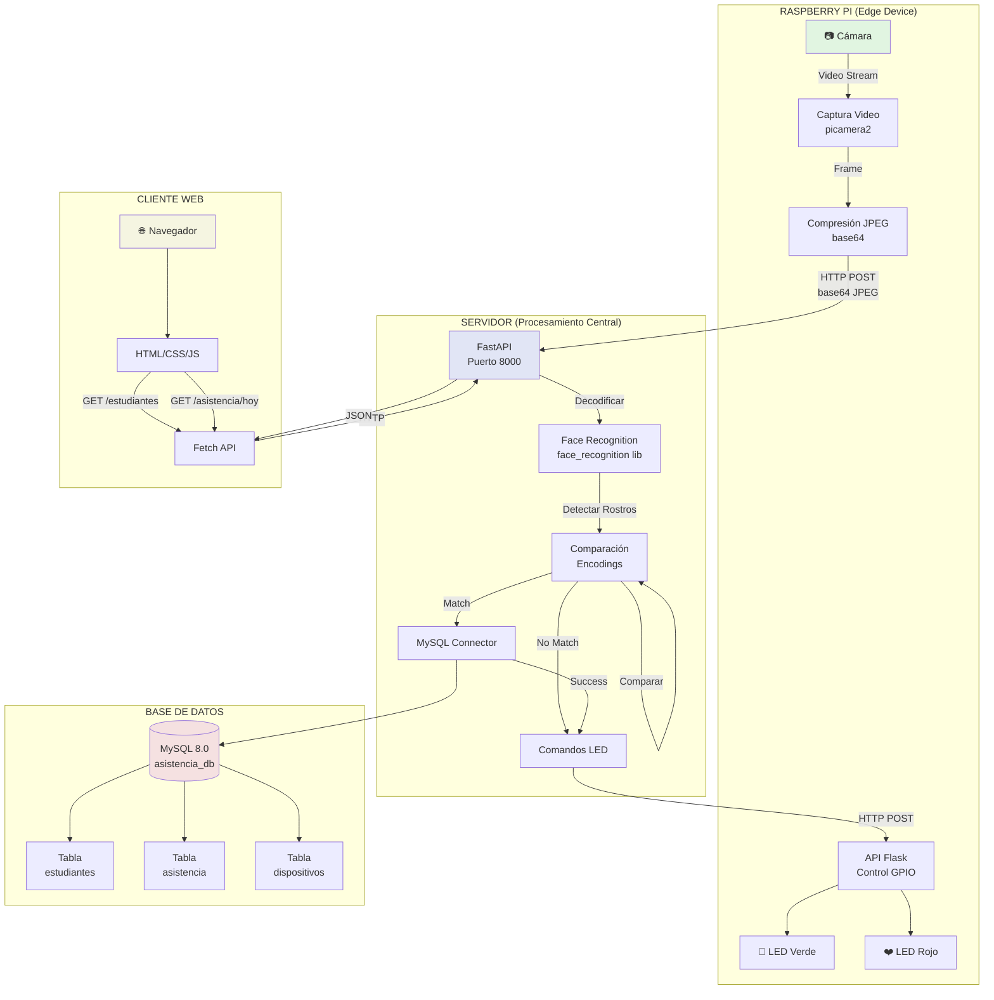
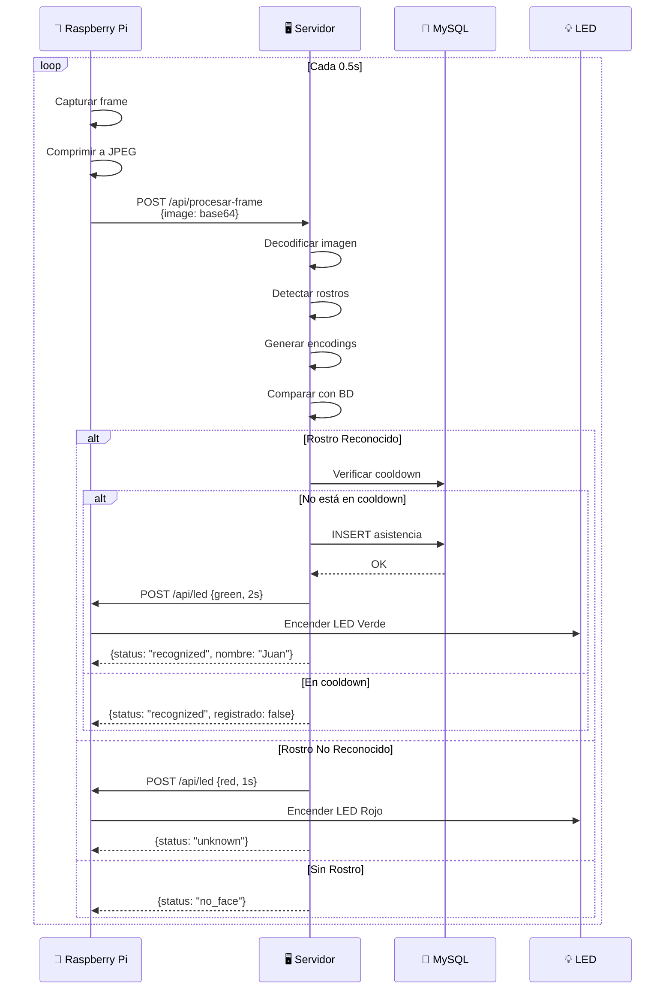
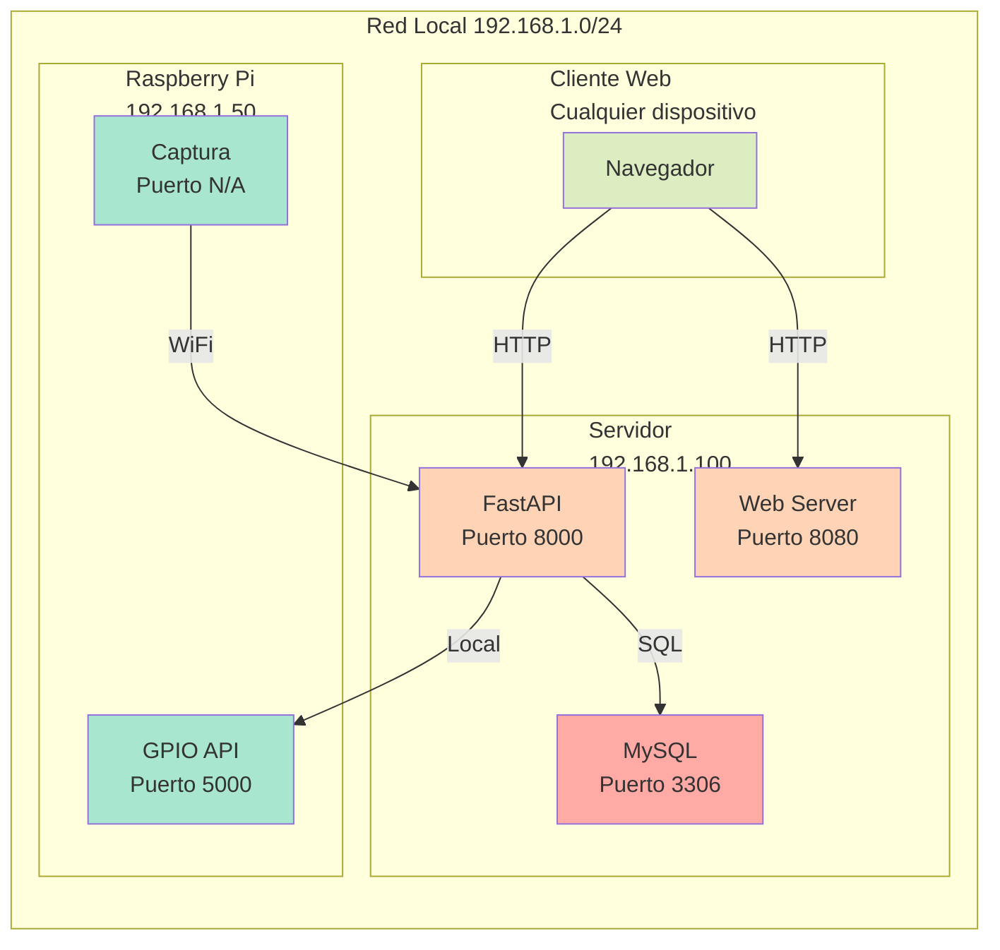
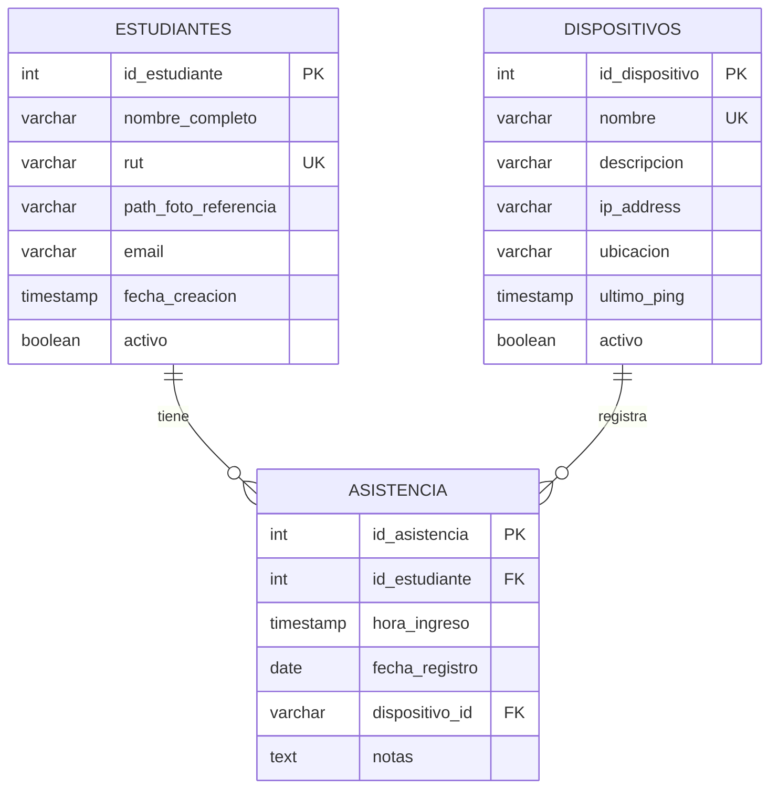
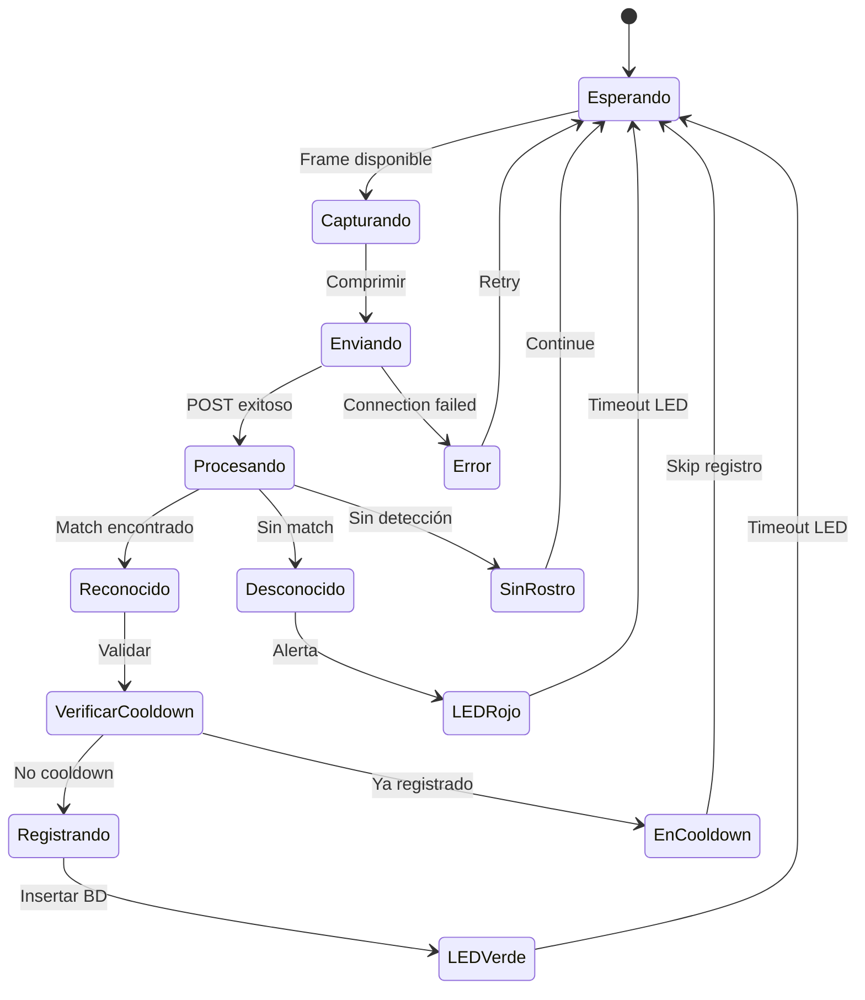
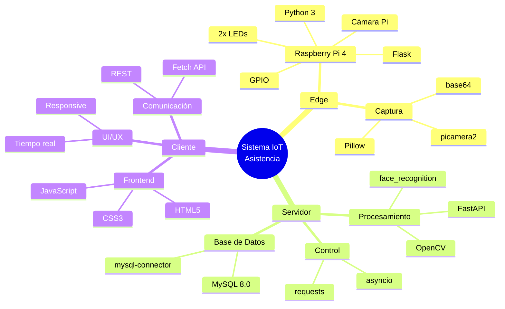

# Diagrama de Arquitectura del Sistema

## Flujo de Datos

## Secuencia de Reconocimiento

## Arquitectura de Red

## Modelo de Datos

## Estados del Sistema

## Componentes y Tecnologías

---

## Notas sobre el Diagrama

1. **Flujo Principal**: La Raspberry Pi captura → Comprime → Envía al servidor vía WiFi
2. **Procesamiento**: El servidor ejecuta face_recognition y registra en MySQL
3. **Feedback**: Servidor envía comandos de vuelta a la Pi para controlar LEDs
4. **Visualización**: Cliente web consulta API REST para mostrar asistencia
5. **Optimización**: Todo el procesamiento pesado está en el servidor, no en la Pi