# Diagrama de Arquitectura del Sistema

## Flujo de Datos

```mermaid
graph TB
    subgraph "RASPBERRY PI (Edge Device)"
        CAM[📷 Cámara]
        CAPTURE[Captura Video<br/>picamera2]
        COMPRESS[Compresión JPEG<br/>base64]
        GPIO_API[API Flask<br/>Control GPIO]
        LED_G[💚 LED Verde]
        LED_R[❤️ LED Rojo]
    end
    
    subgraph "SERVIDOR (Procesamiento Central)"
        API[FastAPI<br/>Puerto 8000]
        FACE_PROC[Face Recognition<br/>face_recognition lib]
        ENCODE[Comparación<br/>Encodings]
        DB_CONN[MySQL Connector]
        LED_CMD[Comandos LED]
    end
    
    subgraph "BASE DE DATOS"
        MYSQL[(MySQL 8.0<br/>asistencia_db)]
        ESTUDIANTES[Tabla<br/>estudiantes]
        ASISTENCIA[Tabla<br/>asistencia]
        DISPOSITIVOS[Tabla<br/>dispositivos]
    end
    
    subgraph "CLIENTE WEB"
        BROWSER[🌐 Navegador]
        HTML[HTML/CSS/JS]
        FETCH[Fetch API]
    end
    
    CAM -->|Video Stream| CAPTURE
    CAPTURE -->|Frame| COMPRESS
    COMPRESS -->|HTTP POST<br/>base64 JPEG| API
    API -->|Decodificar| FACE_PROC
    FACE_PROC -->|Detectar Rostros| ENCODE
    ENCODE -->|Comparar| ENCODE
    
    ENCODE -->|Match| DB_CONN
    ENCODE -->|No Match| LED_CMD
    
    DB_CONN --> MYSQL
    MYSQL --> ESTUDIANTES
    MYSQL --> ASISTENCIA
    MYSQL --> DISPOSITIVOS
    
    LED_CMD -->|HTTP POST| GPIO_API
    GPIO_API --> LED_G
    GPIO_API --> LED_R
    
    DB_CONN -->|Success| LED_CMD
    
    BROWSER --> HTML
    HTML -->|GET /estudiantes| FETCH
    HTML -->|GET /asistencia/hoy| FETCH
    FETCH -->|HTTP| API
    API -->|JSON| FETCH
    
    style CAM fill:#e1f5e1
    style API fill:#e1e5f5
    style MYSQL fill:#f5e1e1
    style BROWSER fill:#f5f5e1
```

## Secuencia de Reconocimiento

## Arquitectura de Red

## Modelo de Datos

## Estados del Sistema

## Componentes y Tecnologías

```mermaid
mindmap
  root((Sistema IoT<br/>Asistencia))
    Edge
      Raspberry Pi 4
        Cámara Pi
        2x LEDs
        Python 3
        Flask
        GPIO
      Captura
        picamera2
        Pillow
        base64
    Servidor
      Procesamiento
        FastAPI
        face_recognition
        OpenCV
      Base de Datos
        MySQL 8.0
        mysql-connector
      Control
        requests
        asyncio
    Cliente
      Frontend
        HTML5
        CSS3
        JavaScript
      Comunicación
        Fetch API
        REST
      UI/UX
        Tiempo real
        Responsive
```

---

## Notas sobre el Diagrama

1. **Flujo Principal**: La Raspberry Pi captura → Comprime → Envía al servidor vía WiFi
2. **Procesamiento**: El servidor ejecuta face_recognition y registra en MySQL
3. **Feedback**: Servidor envía comandos de vuelta a la Pi para controlar LEDs
4. **Visualización**: Cliente web consulta API REST para mostrar asistencia
5. **Optimización**: Todo el procesamiento pesado está en el servidor, no en la Pi